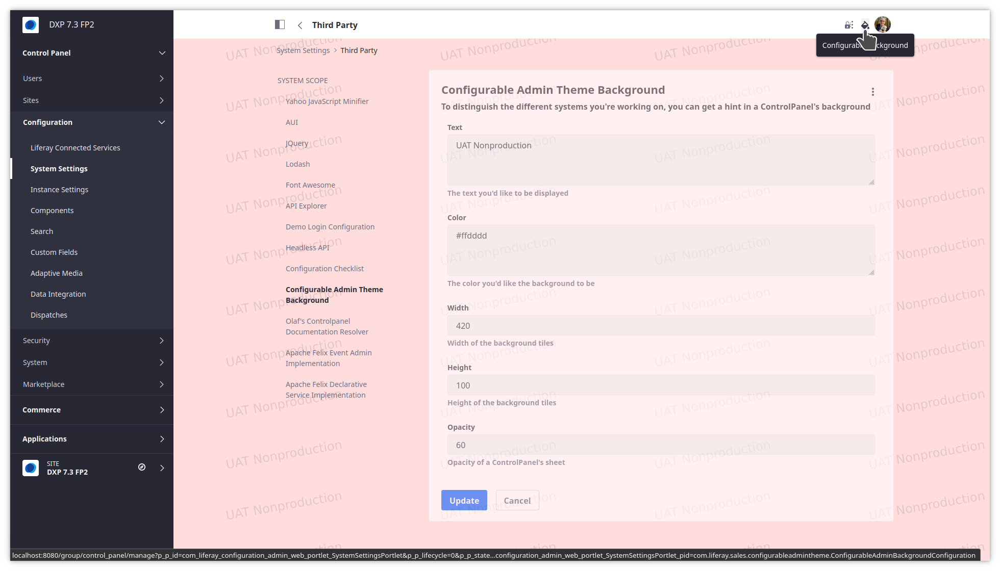

# Configurable Admin Theme Background

Are you working on multiple different installations at the same time? Have you ever entered data in one system that you wanted to enter into a different system?

That could be multiple demo systems. Could be DEV, UAT and PRD.

On the frontend, if you run your own theme or stylebook, you can easily distinguish the systems - if only by color coding. Rarely have I ever seen someone deploying a custom admin-theme to make the Control Panel (and related) views display an easily detectable indicator for the system that you're working on.

This plugin comes to the rescue and displays a textual indicator in the background as well as a chosen color on every Control Panel (and Site Administration) page.

Find the configuration (see screenshot) under System Settings / Third Party or click the color-picker ControlMenuEntry that appears when you're watching a Control Panel page.

Leave text configuration empty to not display any text, but just use color.

New features in 1.0.3:

* more detailed ${version} replacement (includes "Update" for 7.4)
* default opacity changed from 60 to 80% for CP visibility
* new ${group} indicator, as background can also be shown on non-CP pages since 1.0.2
* label angled with just 5° instead of 10 - for reduced height
* release now only built/tested on java 11 (but _should_ compile/work on 8 still)

New features in 1.0.2:

* Built on DXP 7.4
* Configuration has an option to also "decorate" non-ControlPanel pages (but the theme needs to be cooperative)
* The color picker can be hidden
* ${version} as background text will be replaced with the result of `ReleaseInfo.getVersion()`
* ${dxpcname} and ${dxpcenv} will be replaced by the DXPC-account name and the environment (e.g. PRD/UAT) in case the host name follows the standard DXPC naming convention, e.g. `webserver-lctNAME-ENV.lfr.cloud`. Otherwise these variables will be removed and the output trimmed. 
* The default value for text includes all 3 variable indicators.

